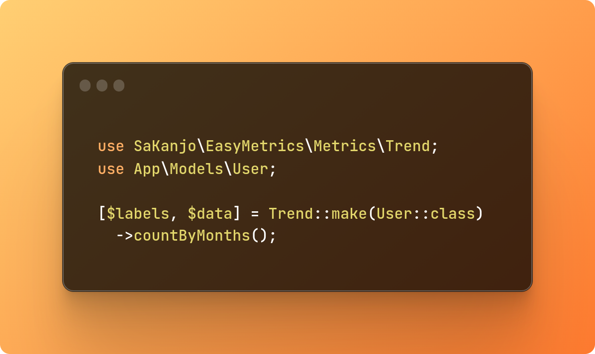
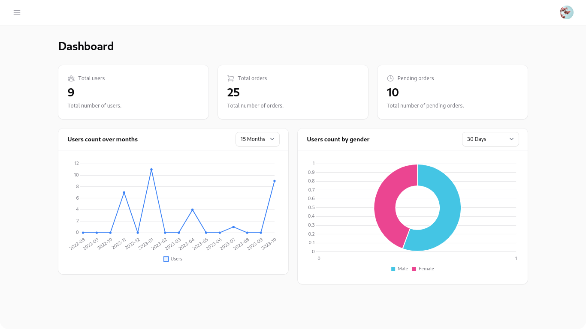

<p align="center">
    <a href="https://laravel.com"></a>
    <a href="https://php.net"></a>
</p>

<h1 align="center">🔥 Easy metrics</h1>

<p align="center">Easily create metrics for your application.</p>

> ✨ Help support the maintenance of this package by [sponsoring me](https://github.com/sponsors/sakanjo).

> Designed to work with **Laravel**, **Filament**, and more.



## 🚀 Supported metrics

- **Bar** metric
- **Doughnut** metric
- **Line** metric
- **Pie** metric
- **Polar** metric
- **Trend** metric
- **Value** metric

Table of contents
=================

* [Install](#install)
* [Usage](#usage)
  * [Value metric](#value-metrics)
  * [Doughnut metric](#doughnut-metric)
  * [Trend metric](#trend-metric)
  * [Other metrics](#other-metrics)
* [Ranges](#ranges)
  * [Available custom ranges](#available-custom-ranges)
* [Practical examples](#practical-examples)
     * [Filamentphp v3 widgets](#filamentphp-v3-widgets)
* [Support the development](#support-the-development)
* [Credits](#credits)
* [License](#license)

## 📦 Install

```
composer require sakanjo/laravel-easy-metrics
```

## 🦄 Usage

### Value metric

```php
use SaKanjo\EasyMetrics\Metrics\Value;
use App\Models\User;

$data = Value::make(User::class)
    ->count();
```

#### Query types

The currently supported aggregate functions to calculate a given column compared to the previous time interval / range

##### Min

```php
Value::make(User::class)
    ->min('age');
```

##### Max

```php
Value::make(User::class)
    ->max('age');
```

##### Sum

```php
Value::make(User::class)
    ->sum('age');
```

##### Average

```php
Value::make(User::class)
    ->average('age');
```

##### Count

```php
Value::make(User::class)
    ->count();
```

### Doughnut metric

```php
use SaKanjo\EasyMetrics\Metrics\Doughnut;
use App\Models\User;
use App\Enums\Gender;

[$labels, $data] = Doughnut::make(User::class)
    ->options(Gender::class)
    ->count('gender');
```

> It's always better to use the `options` method even though it's optional, since the retrieved data may not include all enum options.

#### Query types

The currently supported aggregate functions to calculate a given column compared to the previous time interval / range

##### Min

```php
Doughnut::make(User::class)
    ->min('age', 'gender');
```

##### Max

```php
Doughnut::make(User::class)
    ->max('age', 'gender');
```

##### Sum

```php
Doughnut::make(User::class)
    ->sum('age', 'gender');
```

##### Average

```php
Doughnut::make(User::class)
    ->average('age', 'gender');
```

##### Count

```php
Doughnut::make(User::class)
    ->count('gender');
```

### Trend metric

```php
use SaKanjo\EasyMetrics\Metrics\Trend;
use App\Models\User;

[$labels, $data] = Trend::make(User::class)
    ->countByMonths();
```


#### Query types

The currently supported aggregate functions to calculate a given column compared to the previous time interval / range

##### Min

```php
$trend->minByYears('age'); 
$trend->minByMonths('age'); 
$trend->minByWeeks('age');  
$trend->minByDays('age');  
$trend->minByHours('age');  
$trend->minByMinutes('age');  
```

##### Max

```php
$trend->maxByYears('age'); 
$trend->maxByMonths('age'); 
$trend->maxByWeeks('age');  
$trend->maxByDays('age');  
$trend->maxByHours('age');  
$trend->maxByMinutes('age');  
```

##### Sum

```php
$trend->sumByYears('age'); 
$trend->sumByMonths('age'); 
$trend->sumByWeeks('age');  
$trend->sumByDays('age');  
$trend->sumByHours('age');  
$trend->sumByMinutes('age');  
```

##### Average

```php
$trend->averageByYears('age'); 
$trend->averageByMonths('age'); 
$trend->averageByWeeks('age');  
$trend->averageByDays('age');  
$trend->averageByHours('age');  
$trend->averageByMinutes('age');  
```

##### Count

```php
$trend->countByYears(); 
$trend->countByMonths(); 
$trend->countByWeeks();  
$trend->countByDays();  
$trend->countByHours();  
$trend->countByMinutes();  
```

### Other metrics

- `Bar extends Trend`
- `Line extends Trend`
- `Doughnut extends Pie`
- `Polar extends Pie`


## Ranges

Every metric class contains a ranges method, that will determine the range of the results based on it's date column.

```php
use SaKanjo\EasyMetrics\Metrics\Trend;
use SaKanjo\EasyMetrics\Metrics\Enums\Range;
use App\Models\User;

Value::make(User::class)
    ->range(30)
    ->ranges([
        15, 30, 365,
        Range::TODAY, // Or 'TODAY'
    ]);
```

### Available custom ranges

- `Range::TODAY`
- `Range::YESTERDAY`
- `Range::MTD`
- `Range::QTD`
- `Range::YTD`
- `Range::ALL`

## 🔥 Practical examples

#### Filamentphp v3 widgets

```php
<?php

namespace App\Filament\Widgets\Admin;

use App\Models\User;
use Filament\Widgets\ChartWidget;
use SaKanjo\EasyMetrics\Metrics\Trend;

class UsersCountChart extends ChartWidget
{
    protected static ?string $heading = 'Users count trend';

    protected function getData(): array
    {
        [$labels, $data] = Trend::make(User::class)
            ->range($this->filter)
            ->rangesFromOptions($this->getFilters())
            ->countByMonths();

        return [
            'datasets' => [
                [
                    'label' => 'Users',
                    'data' => $data,
                ],
            ],
            'labels' => $labels,
        ];
    }

    protected function getType(): string
    {
        return 'line';
    }

    protected function getFilters(): ?array
    {
        return [
            15 => '15 Days',
            30 => '30 Days',
            60 => '60 Days',
            365 => '365 Days',
        ];
    }
}

```

## 💖 Support the development

**Do you like this project? Support it by donating**

Click the ["💖 Sponsor"](https://github.com/sponsors/sakanjo) at the top of this repo.

## ©️ Credits

- [Salah Kanjo](https://github.com/sakanjo)
- [All Contributors](../../contributors)

## 📄 License

[MIT License](https://github.com/sakanjo/laravel-easy-metrics/blob/master/LICENSE) © 2023-PRESENT [Salah Kanjo](https://github.com/sakanjo)
